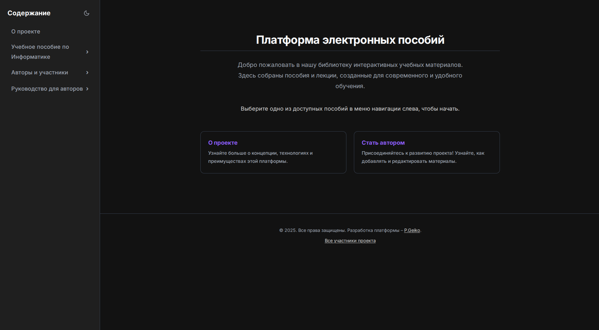

# Платформа для электронных пособий на Nuxt 3



Это open-source проект, предоставляющий гибкий и современный шаблон для создания интерактивных электронных учебных пособий. Платформа построена на Nuxt 3 и Nuxt Content, что позволяет авторам сосредоточиться на написании качественного контента в формате Markdown, получая на выходе быстрый, адаптивный и функциональный веб-сайт.

**Посмотреть демо:** [ссылка на ваш задеплоенный сайт] 

---

## ✨ Ключевые особенности

*   **Контент в Markdown:** Пишите лекции и пособия, используя простой и понятный синтаксис.
*   **Адаптивный дизайн:** Отлично выглядит и работает на десктопах, планшетах и смартфонах.
*   **Светлая и темная темы:** Комфортное чтение в любое время суток.
*   **Интерактивные элементы "из коробки":**
    *   Красивые **математические формулы** (KaTeX).
    *   **Диаграммы и схемы** (Mermaid.js).
    *   **Подсветка синтаксиса** для кода (Prism.js).
    *   Изображения с **увеличением по клику** (Lightbox).
    *   Специальные компоненты для **ссылок на скачивание**.
*   **Автоматическая навигация:** Боковое меню и структура сайта генерируются автоматически на основе вашей структуры папок.
*   **Готовность к совместной работе:** Проект изначально спроектирован для командной работы через Fork и Pull Requests на GitHub.
*   **Простой деплой:** Легко развертывается на платформах вроде Vercel или Netlify за несколько минут.

## 🚀 Технологический стек

*   **Фреймворк:** [Nuxt 3](https://nuxt.com/)
*   **Управление контентом:** [Nuxt Content](https://content.nuxt.com/)
*   **CSS:** Глобальные стили с использованием CSS-переменных (без фреймворков).
*   **Рендеринг формул:** [KaTeX](https://katex.org/)
*   **Рендеринг диаграмм:** [Mermaid.js](https://mermaid-js.github.io/)
*   **Подсветка синтаксиса:** [Prism.js](https://prismjs.com/)

## 🛠️ Локальная разработка

### Требования
- Node.js (рекомендуется версия 18.x или выше)
- npm или pnpm/yarn

### Установка

1.  **Клонируйте репозиторий:**
    ```bash
    git clone https://github.com/your-username/your-repository-name.git
    cd your-repository-name
    ```

2.  **Установите зависимости:**
    ```bash
    npm install
    ```

### Запуск сервера для разработки

Эта команда запустит локальный сервер (обычно на `http://localhost:3000`) с горячей перезагрузкой при изменениях.

```bash
npm run dev
```

### Сборка для деплоя

Эта команда сгенерирует полностью статический сайт в директории `.output/public/`, готовый к загрузке на любой хостинг.

```bash
npm run generate
```

## 🤝 Участие в проекте

Мы приветствуем и ценим любой вклад в развитие этого проекта! Если вы хотите исправить опечатку, добавить новую лекцию или улучшить функционал, пожалуйста, ознакомьтесь с нашим руководством.

➡️ **[Прочитать руководство для контрибьюторов (CONTRIBUTING.md)](./CONTRIBUTING.md)**

##  авторы и разработчики

### Основной автор контента
*   **[Имя Фамилия]** - *[Должность, регалии]*

### Разработчик платформы
*   **[Ваше Имя Фамилия]** - [Ссылка на ваш GitHub] | [Ссылка на ваш сайт/портфолио]

Полный список всех участников можно найти на странице **[Авторы и участники](/contributors)** на сайте проекта. <!-- Убедитесь, что этот путь правильный -->

## 📜 Лицензия

Этот проект распространяется под лицензией MIT. Подробнее см. в файле `LICENSE`.